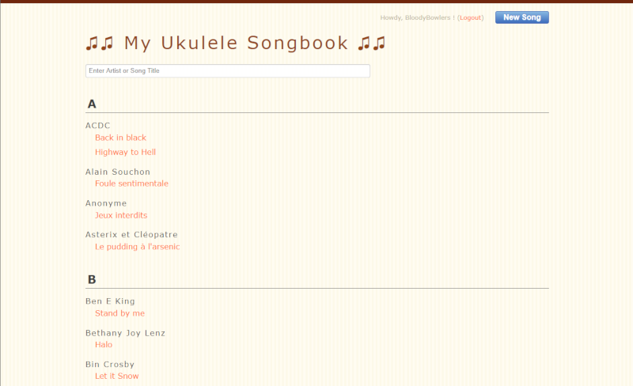
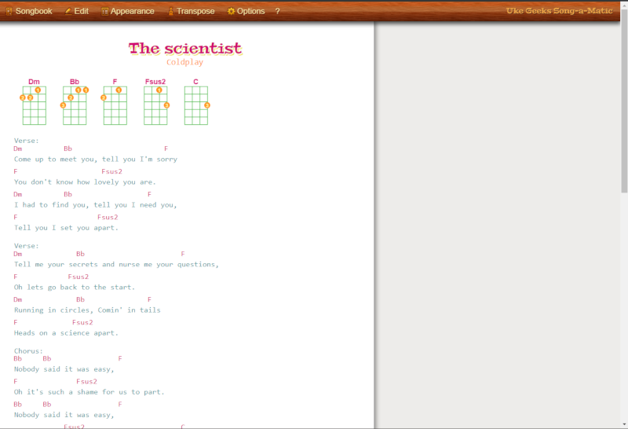

# UkeGeeks-ng

This fork is an attempt at an *enhanced/updated/modified/edited_to_fits_my_needs* version of UkeGeeks  
(since the original doesn't seems to accept pull request since early 2015).

UkeGeeks is a songbook editor for ukulele made by [Buz Carter](http://pizzabytheslice.com) (buz@ukegeeks.com) :)

### What's changed so far :

#### Major features/changes

- Chords now **stay on top** when **scrolling** a song
- Added a **DELETE SONG** button to the EDITOR
- Added a **SONGBOOK** button when viewing a song (to go back)
- **Sorted the song list** by artist and song name + layout change for better search
- Removed **legacy browser** support
- Added full ** TRANSLATION support**. Currently ENGLISH and FRENCH.

#### Improvements, small fixes, QoL changes

- Added some missing chords
- Non-intrusive popup on missing chords
- Various pseudo-security fixes (.gitignore, separate config file, preventing some things to READ only users, ...)
- Switched some calls to HTTPS
- Removed useless SOPRANO tuning references on each pages
- Login page cleanup + ability to hide email
- Made the advanced editor link more obvious + help displayed on startup

### What's planned ?

A lot. Read the issue tracking on github with the label "feature request".

Some features will be hard to implement with the actual code imho, but I'll try anyway without starting from scratch.  
I have only limited time to work on the project...
